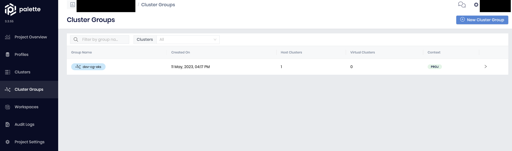

# Spectrocloud problems
* Specs
  * `macOS Monterey 12.4`
  * `Apple M1 processor`
  * `go version go1.20.4 darwin/arm64`
  * `Terraform v1.4.5 on darwin_arm64`

* Init works just fine
```bash
terraform init
```
* Planning works just fine
```bash
terraform plan
```
* Trying to apply this...
```bash
terraform apply -auto-approve
```
* ...throws this error
```bash
Terraform used the selected providers to generate the following execution plan. Resource actions are indicated with the following
symbols:
  + create

Terraform will perform the following actions:

  # spectrocloud_cluster_group.cg will be created
  + resource "spectrocloud_cluster_group" "cg" {
      + context = "project"
      + id      = (known after apply)
      + name    = "dev-cg-eks"

      + clusters {
          + cluster_uid = (sensitive value)
        }

      + config {
          + cpu_millicore            = 6000
          + host_endpoint_type       = "LoadBalancer"
          + memory_in_mb             = 8192
          + oversubscription_percent = 120
          + storage_in_gb            = 10
        }
    }

Plan: 1 to add, 0 to change, 0 to destroy.
spectrocloud_cluster_group.cg: Creating...
╷
│ Error: Plugin did not respond
│
│   with spectrocloud_cluster_group.cg,
│   on main.tf line 1, in resource "spectrocloud_cluster_group" "cg":
│    1: resource "spectrocloud_cluster_group" "cg" {
│
│ The plugin encountered an error, and failed to respond to the plugin.(*GRPCProvider).ApplyResourceChange call. The plugin logs
│ may contain more details.
╵

Stack trace from the terraform-provider-spectrocloud_v0.13.2 plugin:

panic: runtime error: invalid memory address or nil pointer dereference
[signal SIGSEGV: segmentation violation code=0x2 addr=0x0 pc=0x101c8b378]

goroutine 27 [running]:
github.com/spectrocloud/palette-sdk-go/client.(*V1Client).GetClusterGroup(0x14000968dc8?, {0x140001a5ab8?, 0x10212015b?}, {0x1400060f300?, 0x10212015b?})
	github.com/spectrocloud/palette-sdk-go@v0.0.0-20230502044012-10512e17ec52/client/cluster_group.go:68 +0x38
github.com/spectrocloud/terraform-provider-spectrocloud/spectrocloud.resourceClusterGroupRead({0x14000a13b80?, 0x140001a5ab8?}, 0x14000a13b80, {0x102955e60?, 0x1400059e000})
	github.com/spectrocloud/terraform-provider-spectrocloud/spectrocloud/resource_cluster_group.go:145 +0x108
github.com/spectrocloud/terraform-provider-spectrocloud/spectrocloud.resourceClusterGroupCreate({0x1029808c8, 0x14000301440}, 0x0?, {0x102955e60?, 0x1400059e000?})
	github.com/spectrocloud/terraform-provider-spectrocloud/spectrocloud/resource_cluster_group.go:131 +0x120
github.com/hashicorp/terraform-plugin-sdk/v2/helper/schema.(*Resource).create(0x140004c48c0, {0x102980900, 0x14000847e00}, 0xd?, {0x102955e60, 0x1400059e000})
	github.com/hashicorp/terraform-plugin-sdk/v2@v2.26.1/helper/schema/resource.go:707 +0xe8
github.com/hashicorp/terraform-plugin-sdk/v2/helper/schema.(*Resource).Apply(0x140004c48c0, {0x102980900, 0x14000847e00}, 0x14000a0b1e0, 0x14000a13a00, {0x102955e60, 0x1400059e000})
	github.com/hashicorp/terraform-plugin-sdk/v2@v2.26.1/helper/schema/resource.go:837 +0x86c
github.com/hashicorp/terraform-plugin-sdk/v2/helper/schema.(*GRPCProviderServer).ApplyResourceChange(0x14000650000, {0x102980900?, 0x14000847ce0?}, 0x140001805a0)
	github.com/hashicorp/terraform-plugin-sdk/v2@v2.26.1/helper/schema/grpc_provider.go:1021 +0xb70
github.com/hashicorp/terraform-plugin-go/tfprotov5/tf5server.(*server).ApplyResourceChange(0x1400031a0a0, {0x102980900?, 0x140008472f0?}, 0x140004d97a0)
	github.com/hashicorp/terraform-plugin-go@v0.14.3/tfprotov5/tf5server/server.go:818 +0x3b8
github.com/hashicorp/terraform-plugin-go/tfprotov5/internal/tfplugin5._Provider_ApplyResourceChange_Handler({0x1028dcd80?, 0x1400031a0a0}, {0x102980900, 0x140008472f0}, 0x140004d9730, 0x0)
	github.com/hashicorp/terraform-plugin-go@v0.14.3/tfprotov5/internal/tfplugin5/tfplugin5_grpc.pb.go:385 +0x170
google.golang.org/grpc.(*Server).processUnaryRPC(0x1400024e780, {0x102985160, 0x14000003d40}, 0x14000156fc0, 0x1400064a270, 0x1037990e0, 0x0)
	google.golang.org/grpc@v1.51.0/server.go:1340 +0xb7c
google.golang.org/grpc.(*Server).handleStream(0x1400024e780, {0x102985160, 0x14000003d40}, 0x14000156fc0, 0x0)
	google.golang.org/grpc@v1.51.0/server.go:1713 +0x82c
google.golang.org/grpc.(*Server).serveStreams.func1.2()
	google.golang.org/grpc@v1.51.0/server.go:965 +0x84
created by google.golang.org/grpc.(*Server).serveStreams.func1
	google.golang.org/grpc@v1.51.0/server.go:963 +0x290

Error: The terraform-provider-spectrocloud_v0.13.2 plugin crashed!

This is always indicative of a bug within the plugin. It would be immensely
helpful if you could report the crash with the plugin's maintainers so that it
can be fixed. The output above should help diagnose the issue.
```
* Destroying it ...
```bash
terraform destroy -auto-approve
```
* ... tells us there are no changes (nothing to destroy) ...
```bash
No changes. No objects need to be destroyed.

Either you have not created any objects yet or the existing objects were already deleted outside of Terraform.

Destroy complete! Resources: 0 destroyed.
```
* ... but in the WebUI there's clearly something

